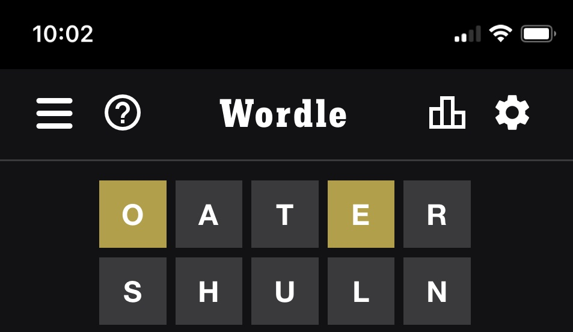
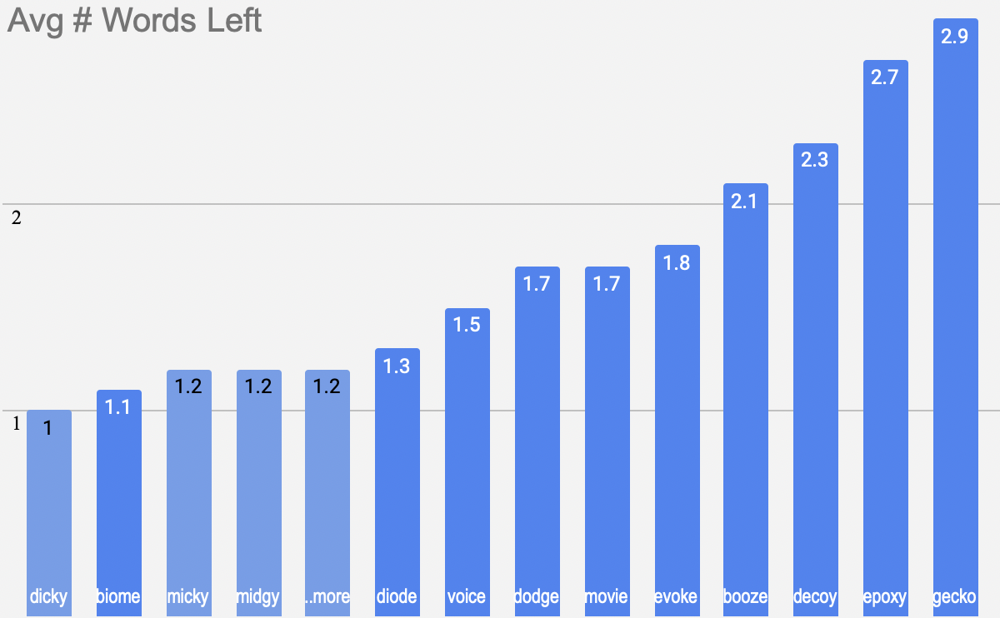

### End Result
- If the algorithm is played start to finish it averages 3.5 guesses to solve Wordle

<details>
<summary> How</summary> 

- Do you really want to know all details in written form?  
- Kudos if so
- Here's an abbreviated version

## Words Left
- First, filter the 2309 targets down to just the targets that meet the current clues
    - If we use the OATER and SHULN guesses and clues, that narrows the 2309 possible  targets down to 10
<center>

  

||||||
|---|---|---|---|---|
| voice | movie | biome | decoy | gecko |
| epoxy | dodge | booze | diode | evoke |

</center>

## Algorithm
### Goal
- Any one of the 10 targets remaining could be the right one.  
- So we want to know which of the 13,000+ playable guesses would have good filtering results verse ALL the possible targets left. 
### Approach
* Take each one of the ~13,000 playable guesses and play each guess against each target remaining. 
* Each time a guess is played against a target, we end up with a new amount of targets left.
* In this case: 
    * If the guess matches the target that's 0 targets left
    * If the guess somehow provided no extra clues, that's 10 targets left
    * If the guess provided some new clues, that will be some number between 0 and 10
* After a guess is played against all the possible targets remaining, we can average the amount of words left it created when played against each target
* This average is referred to as the guess's "narrowing ability"
### Example
- Using the top two guesses (out of 13,000+)
<center>

| Guess | Target | Words Left |  | Guess | Target | Words Left |
|---|---|---| ---|---|---|---|
| DICKY | VOICE | 1 | | BIOME | VOICE | 1 |
| DICKY | MOVIE | 1 | | BIOME | MOVIE | 1 |
| DICKY | BIOME | 1 | | BIOME | BIOME | 0 |
| DICKY | DECOY | 1 | | BIOME | DECOY | 2 | 
| DICKY | GECKO | 1 | | BIOME | GECKO | 2 | 
| DICKY | EPOXY | 1 | | BIOME | EPOXY | 1 |
| DICKY | DODGE | 1 | | BIOME | DODGE | 1 |
| DICKY | BOOZE | 1 | | BIOME | BOOZE | 1 |
| DICKY | DIODE | 1 | | BIOME | DIODE | 1 |
| DICKY | EVOKE | 1 | | BIOME | EVOKE | 1 |
|avg  | | 1.0 | | avg | | 1.1| 

</center>

``` 
Playing "DICKY" is guaranteed to give us clues that will narrow our remaining targets down to 1. 
    - Narrowing score of 1
    - It's also guaranteed not to win on this turn

Playing "BIOME" does have a 10% chance to win this turn, but a 20% chance of leaving us with 2 targets left.
    - Narrowing score of 1.1
    - Chance to win this turn
    - Failed to differentiate between DECOY and GECKO

Tie goes to the guess that has a chance of winning in that turn. 
```
</details>

<details>
<summary> Output</summary> 
- A score that represents the narrowing ability of the next guess
<center>



`guesses ranked by "narrowing ability"`
</center>
</details>

<details>
<summary> Inputs</summary> 
- Guesses
- Clues from guesses
- Wordle's list of 2,309 possible answers ("common words" I refer to as "targets")
- Wordle's list of ~13,000 acceptable guesses ("dictionary words" I refer to as "playable guesses")  
<center>
  


`guesses and clues`
</center>
</details>


